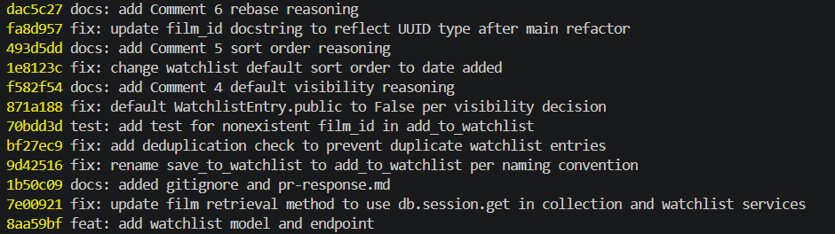

# PR Response Doc — CineLog Watchlist Feature

## AI Usage
I used AI (Claude) throughout this project in a few specific ways:
 
- **Codebase orientation:** Before making changes, I had AI help me understand collection_service.py's patterns (e.g. how add_to_collection() handles deduplication) so I could follow the same structure in watchlist_service.py rather than inventing a new approach.
- **Stress-testing design arguments (Comments 4 and 5):** For the default visibility and sort order decisions, I wrote my own position and reasoning first, then used AI to check my draft for gaps — specifically whether I was acknowledging real tradeoffs and directly engaging with the maintainer's stated reasoning rather than just asserting a preference. This helped me sharpen the Comment 5 response to more directly address the maintainer's "most users want recency" point, and to explicitly note the consistency with the existing collection sort order.
- **Merge conflict guidance:** I used AI to help interpret git conflict markers during the Comment 6 rebase (understanding what the "current" vs "incoming" sections meant in models.py) and to talk through the resolution — but the actual decision (updating film_id to the UUID type) was based on reading the surrounding code myself.
- **Commit hygiene:** I used AI to review my commit history for conventional commit format issues before finalizing — it flagged one early commit ("added watchlist model and endpoint fixed a bug more changes") as non-conventional and bundled, which I fixed via `git rebase -i`.
The actual code changes, test logic, and final wording of my design decision arguments (Comments 4 and 5) are my own — AI was used for orientation, review, and catching gaps, not for writing the reasoning itself.
 

## Comment 1 — Rename
*What I did:** Renamed `save_to_watchlist()` to `add_to_watchlist()` in services/watchlist_service.py to match the project's verb_to_noun convention (consistent with add_to_collection()). Updated the import and call site in routes/watchlist/watchlist.py.
**How I verified:** Searched the project with `Select-String -Recurse -Filter *.py -Pattern "save_to_watchlist"` and confirmed no remaining references. Ran full test suite (pytest tests/ -v) — all 4 existing tests pass.

## Comment 2 — Deduplication
**What I did:** Added an `AlreadyInWatchlistError` exception class and a duplicate check in `add_to_watchlist()`, following the same pattern as `add_to_collection()` in collection_service.py — query for an existing entry with matching user_id/film_id before creating a new one, and raise if found.
**How I verified:** Ran the full test suite (pytest tests/ -v) — all 4 existing tests still pass. (No test yet directly exercises the duplicate case; that's addressed as part of Comment 3's test coverage / can add one as a stretch test.)

## Comment 3 — Missing test
**What I did:** Created tests/test_watchlist.py with test_add_to_watchlist_nonexistent_film_raises, modeled directly on test_add_to_collection_nonexistent_film_raises from test_collection.py — same fixture structure (app, sample_user, sample_film) and same assertion pattern (pytest.raises(FilmNotFoundError) with a fake UUID).
**How I verified:** Ran `pytest tests/test_watchlist.py -v` (passed), then the full suite `pytest tests/ -v` — all 5 tests pass, no regressions.

## Comment 4 — Default visibility
**My position:** Watchlists should default to private (public=False), not public.
**Reasoning:** Even though CineLog is a community film-tracking app, I don't think users should have to share their watchlist by default. A watchlist is more personal than a watched list since it reflects movies someone plans to watch, which they may not be ready to share publicly. Making it private by default lets users choose to share when they're comfortable instead of accidentally exposing their interests.
**Tradeoff acknowledged:** Fewer public watchlists means less content for discovery and recommendations. However, I think that's a better tradeoff than surprising users by making their watchlist visible without them realizing it. Users who want to participate in the social aspect of the app can still easily change the visibility to public, while users who value privacy don't have to opt out first. I could also see a more flexible system in the future (private, followers-only, public), but with the current boolean design, defaulting to private is the safer and more user-friendly choice.

## Comment 5 — Sort order
**My position:** Agree with the maintainer — default to date_added.desc() instead of alphabetical.
**Reasoning:** For a watchlist, recency is what most users are looking for since people usually add movies after getting a recommendation, watching a trailer, or hearing about a new release. When they come back later, they're more likely to want to find those recently added movies than browse the entire list alphabetically. This also keeps the watchlist consistent with the watched collection, which is already sorted by date_added.desc(), making the app's behavior more predictable across features.
**Engagement with reviewer's point:** I agree with the maintainer's reasoning that most users want to see what they added recently. The main downside is that alphabetical sorting can be helpful for very large watchlists or when trying to quickly check if a specific movie is already there — but I think recency is the better default for the common use case, and alphabetical could be offered later as an optional view instead of replacing the default.

## Comment 6 — Rebase
**What conflicted:** models.py had a merge conflict because the WatchlistEntry model (added on feature/watchlist) didn't exist on main, which had migrated Film.id and all foreign keys from Integer to UUID (String(36)) in a separate refactor. Git couldn't auto-merge the addition, and WatchlistEntry.film_id was still typed as db.Integer.
**How I resolved it:** Kept the WatchlistEntry class and updated film_id from db.Column(db.Integer, ...) to db.Column(db.String(36), ...) to match the new UUID foreign key type used by Film.id and CollectionEntry.film_id.
**How I verified no conflict remains:** Ran git log --oneline to confirm a clean, linear history with no merge commits. Ran pytest tests/ -v — all tests pass after resolving the conflict and updating the field type.

## PR Description
This PR adds a watchlist feature to CineLog, allowing users to save films they want to watch later, separate from their collection of films they've already watched. Users can add films to their watchlist, view their watchlist, and the feature prevents duplicate entries and invalid film IDs.
 
**Design decisions:**
- **Default visibility:** Watchlists default to private (`public=False`), since a watchlist reflects what a user plans to watch, not necessarily something they want to share. Making it private by default avoids exposing a user's watchlist before they choose to share it.
- **Sort order:** Watchlists are sorted by date added (most recent first). People usually add movies after getting a recommendation or seeing a trailer, so showing the newest additions first makes it easier to find them again. This also keeps the behavior consistent with the collection feature.
**Manual testing steps:**
 
1. Run the automated test suite to verify core service-layer behavior:
```bash
   pytest tests/ -v
```
   This confirms the rename, deduplication, and nonexistent-film handling all work as expected.
 
2. To manually test via the API, since the app has no seed data or user-creation endpoint, create a test user and film directly using Flask's app context (in a Python shell):
```python
   from app import create_app, db
   from models import User, Film
 
   app = create_app()
   with app.app_context():
       db.create_all()
       user = User(username="testuser", email="test@example.com")
       film = Film(title="Whiplash", year=2014, genre="Drama")
       db.session.add_all([user, film])
       db.session.commit()
       print("user_id:", user.id)
       print("film_id:", film.id)
```
 
3. Start the app: `python app.py`
4. Add the film to the user's watchlist:
```bash
   curl -X POST http://127.0.0.1:5000/watchlist/<user_id>/add -H "Content-Type: application/json" -d "{\"film_id\":\"<film_id>\"}"
```
   Confirm a 201 response containing the new watchlist entry, with `public: false` by default.
 
5. Try adding the same film again — confirm this raises an error instead of creating a duplicate entry.
6. Try adding a nonexistent film_id (e.g. `00000000-0000-0000-0000-000000000000`) — confirm this raises an error rather than succeeding.
7. View the user's watchlist:
```bash
   curl http://127.0.0.1:5000/watchlist/<user_id>
```
   Confirm the film's full details are returned (title, genre, year, etc.), sorted by most recently added first.

## Commit History

